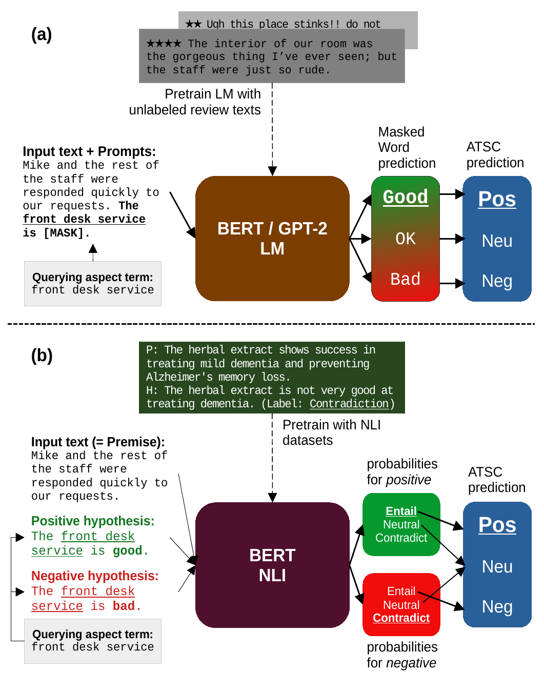

# atsc_prompts



This repository contains the codes used to produce the results from our EMNLP 2021 paper [*Open Aspect Target Sentiment Classification with Natural Language Prompts*](https://link.iamblogger.net/atscprompts-paper).

Before executing any of the codes in the repo, please set up an [Anaconda environment](https://link.iamblogger.net/2to7k) on your system by running

```bash
conda env create -f environment.yml
```

Although we also listed core dependencies in `requirements.txt` that you could feed into `pip`, we recommend using Anaconda and our [`environment.yml`](https://link.iamblogger.net/y4a1b) as there might be dependencies that are not fully fulfilled by [`requirements.txt`](https://link.iamblogger.net/yxicy). 

If you want to try training your own prompt-based ATSC model, you will probably want to start with the directories with the prefix `prompts_supervised_`. Please refer to the descriptions below for what each directory in this repo is about:

- `pretraining` contains the Jupyter notebook files with the training loop for further pretraining BERT/GPT-2 LMs. As described in our paper, we modify the pretraining objective for BERT, which is implemented as a thing called "data collator" compatible with the Huggingface library (see utils/data_collator_smart_mlm.py.)

- `prompts_supervised_*` directories contain the notebook files for full-shot/few-shot training. I recommend skimming these notebooks first. PyTorch modules for converting LM/NLI outputs to ATSC prediction are defined in [`utils/prompt_output_head.py`](https://link.iamblogger.net/jymqn).

- `prompts_zero_shot_*` directories contain the notebook files for testing zero-shot cases.

- `prompts_subtask4_*` directories contain the notebook files for testing ATSC models on aspect category sentiment classification (ACSC) without additional training.

## Citation

If you are using our code for your paper, please cite our paper using the following BibTeX entry:

```
@inproceedings{seoh-etal-2021-open,
    title = "Open Aspect Target Sentiment Classification with Natural Language Prompts",
    author = "Seoh, Ronald  and
      Birle, Ian  and
      Tak, Mrinal  and
      Chang, Haw-Shiuan  and
      Pinette, Brian  and
      Hough, Alfred",
    booktitle = "Proceedings of the 2021 Conference on Empirical Methods in Natural Language Processing",
    month = nov,
    year = "2021",
    address = "Online and Punta Cana, Dominican Republic",
    publisher = "Association for Computational Linguistics",
    url = "https://aclanthology.org/2021.emnlp-main.509",
    pages = "6311--6322",
    abstract = "For many business applications, we often seek to analyze sentiments associated with any arbitrary aspects of commercial products, despite having a very limited amount of labels or even without any labels at all. However, existing aspect target sentiment classification (ATSC) models are not trainable if annotated datasets are not available. Even with labeled data, they fall short of reaching satisfactory performance. To address this, we propose simple approaches that better solve ATSC with natural language prompts, enabling the task under zero-shot cases and enhancing supervised settings, especially for few-shot cases. Under the few-shot setting for SemEval 2014 Task 4 laptop domain, our method of reformulating ATSC as an NLI task outperforms supervised SOTA approaches by up to 24.13 accuracy points and 33.14 macro F1 points. Moreover, we demonstrate that our prompts could handle implicitly stated aspects as well: our models reach about 77{\%} accuracy on detecting sentiments for aspect categories (e.g., food), which do not necessarily appear within the text, even though we trained the models only with explicitly mentioned aspect terms (e.g., fajitas) from just 16 reviews - while the accuracy of the no-prompt baseline is only around 65{\%}.",
}
```

## License

`atsc_prompts` is licensed under the Apache 2.0 license. Please check `LICENSE`.
